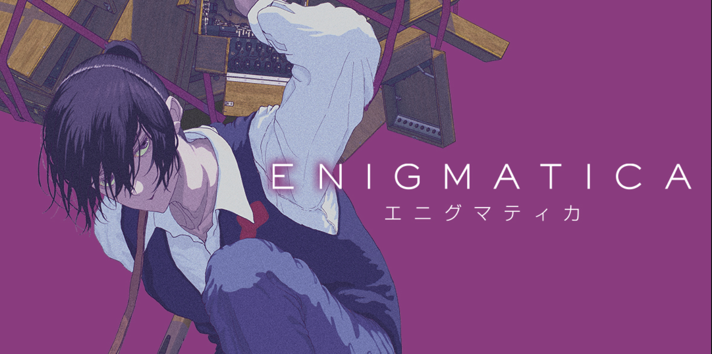

# enigmatica

Cipher experiments and puzzle-game scaffolding inspired by manga-style decoding challenges.



## Current structure

```text
assets/
├── chapters/   # source images and reference materials for each chapter
docs/
├── chapters/   # chapter notes, reasoning, and image references
src/
├── chapters/   # chapter-specific demos and level builders
├── ciphers/    # reusable cipher and analysis logic
├── game/       # puzzle, player, level, and engine building blocks
└── main.py     # minimal CLI entry point
```

## Quick start

```bash
uv sync
uv run enigmatica list
uv run enigmatica demo c001
uv run enigmatica play c001
```

You can also run the module directly:

```bash
python3 -m src.main list
python3 -m src.main demo c001
python3 -m src.main play c001
```

## Design notes

- Cipher logic lives in `src/ciphers/` so chapters and the future game loop can share it.
- `src/ciphers/` can also hold reusable decoding helpers that are not strict classical ciphers, such as index-based extraction.
- Chapter files expose both a human-readable demo and a reusable `Level` builder, and each chapter can contain multiple puzzles.
- `docs/chapters/` acts as the project notebook for puzzle snapshots, reasoning, and game-design notes.
- `assets/chapters/` stores the corresponding source images or other visual references, ideally one file per puzzle.
- The CLI is intentionally small today, but it already speaks in terms of chapters and levels so it can grow into a real game loop later.

## uv environment

- The repo uses `.python-version` to pin local development to Python 3.12.
- Run `uv sync` to create `.venv` from `pyproject.toml`.
- Use `uv run ...` so you do not accidentally use a system `python3` that is too old for the project.
