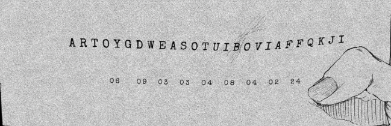
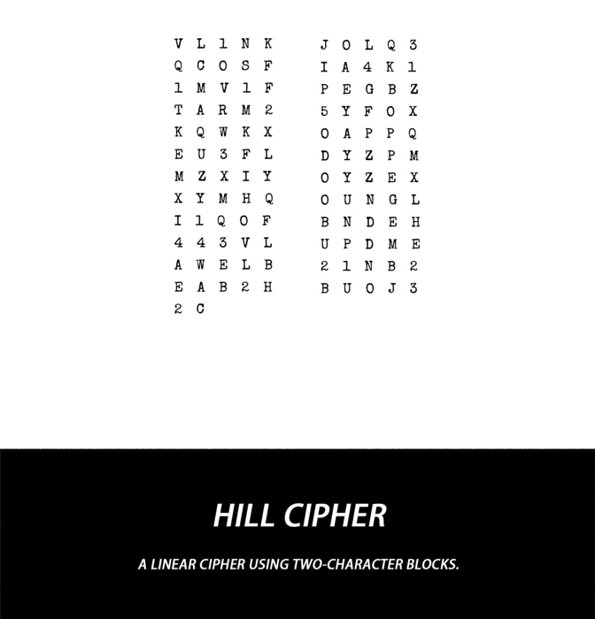

# c001 - 12 HOURS LEFT TO LIVE

This chapter is structured to support multiple puzzles in sequence.

## Assets

- Puzzle 1 image path: `assets/chapters/c001/puzzle-01.png`
- Puzzle 2 image path: `assets/chapters/c001/puzzle-02.png`
- Puzzle 3 image path: `assets/chapters/c001/puzzle-03.png`

## Puzzle 1 - Indexed Extraction

### Snapshot

Place the first puzzle image at `assets/chapters/c001/puzzle-01.png`.

When the file is added, this relative path will render it in markdown viewers that support local images:

```md

```

### Observed Data

- Letter strip: `ARTOYGDWEASOTUIBOVIAFFQKJI`
- Number row: `06 09 03 03 04 08 04 02 24`
- Expected answer from the manga puzzle: `Get To Work`

### Mechanic

This chapter uses direct 1-based index extraction rather than a classical cipher. Each number points to a position in the letter strip above it, and the selected letters spell the answer.

### Reasoning

- `06 -> G`
- `09 -> E`
- `03 -> T`
- `03 -> T`
- `04 -> O`
- `08 -> W`
- `04 -> O`
- `02 -> R`
- `24 -> K`

Joined result: `GETTOWORK`

Formatted result: `Get To Work`

### Answer

- Final answer: `Get To Work`

### Code Mapping

- Chapter file: `src/chapters/c001.py`
- Puzzle builder: `build_puzzle_01()`
- Reusable helper: `src/ciphers/indexing.py`
- Runtime path: `uv run enigmatica demo c001` or `uv run enigmatica play c001`

### Game Adaptation Notes

- The player can inspect a strip of letters and type the decoded phrase.
- A first hint can explain that the positions are 1-based.
- Later levels could hide the strip, split it into segments, or combine extraction with another mechanic.

## Puzzle 2 - Board Warning

### Snapshot

Place the second puzzle image at `assets/chapters/c001/puzzle-02.png`.

```md

```

### Observed Data

- Board reference is split into a left block and right block.
- Source clue: `14 34 24 69`
- Extracted warning: `TRAP`

### Mechanic

This puzzle uses grid-based extraction. The board acts like a coordinate reference, and selected cells spell a warning word.

### Reasoning

- The source clue is recorded as `14 34 24 69`.
- The board highlights `T`, `R`, and `A` on row 4 of the left block.
- The final extracted letter is `P` in the lower-right portion of the board.

Board trace used by the implementation: `(1,4) -> T`, `(3,4) -> R`, `(2,4) -> A`, `(9,6) -> P`

### Answer

- Final answer: `TRAP`

### Code Mapping

- Chapter file: `src/chapters/c001.py`
- Puzzle builder: `build_puzzle_02()`
- Reusable helper: `src/ciphers/grid.py`
- Runtime path: `uv run enigmatica demo c001` or `uv run enigmatica play c001`

### Game Adaptation Notes

- The player can inspect a board reference and extract a word from marked coordinates.
- A hint can focus attention on row 4 first so the pattern becomes visible.
- Later grid puzzles could use different board sizes or combine coordinates with another cipher layer.

## Puzzle 3 - Guided Hill Cipher

### Snapshot

Place the third puzzle image at `assets/chapters/c001/puzzle-03.png`.

```md

```

### Observed Data

- This stage uses a 2-character Hill cipher over a 31-character alphabet.
- Chapter alphabet used in code: `ABCDEFGHIJKLMNOPQRSTUVWXYZ12345`
- Ciphertext used for the playable puzzle: `QBRAEOME`
- The real chapter notes suggest matrix-based reasoning, but the game version uses a shorter adapted ciphertext plus a crib.

### Mechanic

The underlying code implements a real 2x2 Hill cipher, but the player-facing puzzle is softened into a decoder crib. That keeps the chapter faithful to the source without forcing manual matrix algebra during play.

### Reasoning

- Break the ciphertext into bigrams: `QB RA EO ME`
- Use the recovered crib to map each block:
  `QB -> MI`, `RA -> SS`, `EO -> IO`, `ME -> N3`
- Join the result: `MISSION3`
- Remove the trailing filler `3`

### Answer

- Final answer: `MISSION`

### Code Mapping

- Chapter file: `src/chapters/c001.py`
- Puzzle builder: `build_puzzle_03()`
- Reusable helper: `src/ciphers/hill.py`
- Runtime path: `uv run enigmatica demo c001` or `uv run enigmatica play c001`

### Game Adaptation Notes

- The game should reveal the bigram crib instead of making the player derive the key matrix.
- The real Hill-cipher logic still exists for authenticity, replay tools, or harder optional content.
- Later chapters can expose more of the underlying math if you want difficulty to ramp up.
- This playable version uses a short ciphertext generated from the recovered key so the puzzle stays readable in a CLI.

## Chapter Notes

- Chapter 1 should feel like one continuous decoding sequence, even if the puzzles use different mechanics.
- The runtime model already supports this by treating the chapter as one `Level` with several `Puzzle` objects.
