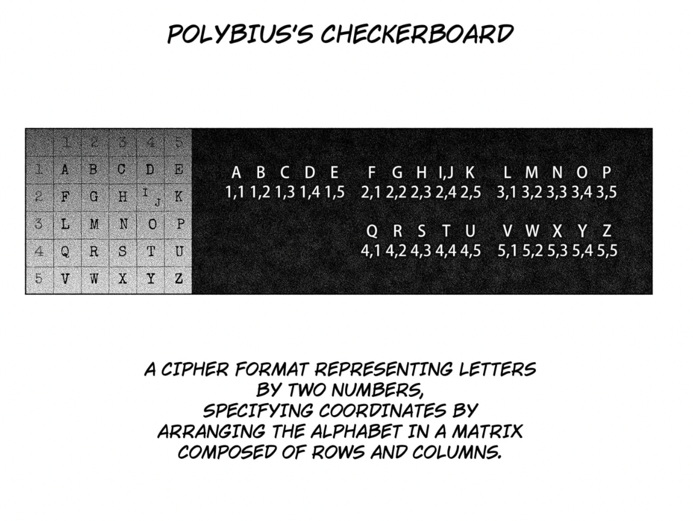
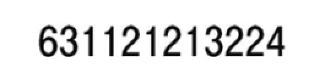

# c002 - 3 HOURS LEFT TO LIVE

This chapter currently contains one implemented puzzle. Replace the placeholder chapter title once the manga chapter title is confirmed.

## Assets

- Rule image path: `assets/chapters/c002/rule-puzzle-01.png`
- Puzzle image path: `assets/chapters/c002/puzzle-01.png`

## Puzzle 1 - Polybius Checkerboard

### Snapshot

### Observed Data

- Mechanic reference: `POLYBIUS'S CHECKERBOARD`
- Board rows: `ABCDE`, `FGHIK`, `LMNOP`, `QRSTU`, `VWXYZ`
- Intended answer supplied for the chapter puzzle: `RABBIT`
- Digits visible in the supplied puzzle crop: `631121213224`

### Mechanic

A Polybius checkerboard maps every letter to two digits: the first digit identifies its row and the second digit identifies its column. The board combines `I` and `J` into the same cell so that the alphabet fits inside a `5x5` grid.

### Playable Adaptation

The supplied cropped digit clue does not decode to `RABBIT` under the standard checkerboard shown in the rule image. Under that board, the verified coordinates for `RABBIT` are:

`42 11 12 12 24 44`

The playable implementation uses those verified coordinates while preserving the supplied crop as source documentation. This can be revised if a fuller or corrected panel provides the missing context.

### Reasoning

- `42 -> R`
- `11 -> A`
- `12 -> B`
- `12 -> B`
- `24 -> I`
- `44 -> T`

Joined result: `RABBIT`

### Answer

- Final answer: `RABBIT`

### Code Mapping

- Chapter file: `src/chapters/c002.py`
- Puzzle builder: `build_puzzle_01()`
- Reusable helper: `src/ciphers/polybius.py`
- Runtime path: `uv run enigmatica demo c002` or `uv run enigmatica play c002`

### Game Adaptation Notes

- The player receives the rule reference alongside the digit puzzle.
- The current version asks the player to decode verified row-column pairs.
- Future Polybius puzzles can omit the board once the mechanic has been taught or use custom alphabets and larger grids.

## Chapter Notes

- Chapter 2 is the first chapter to use a formal named coordinate cipher directly.
- The web interface needs to support both a rule/reference image and the manga puzzle image for this style of introduction.
