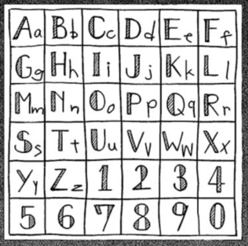
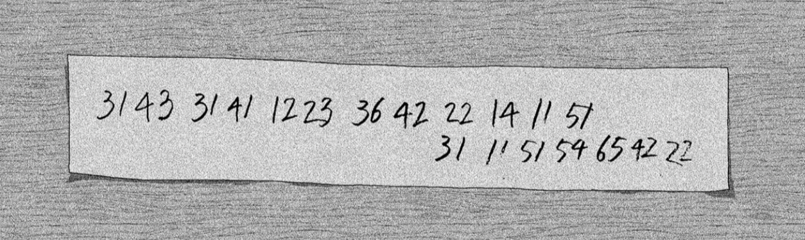

# c002 - 3 HOURS LEFT TO LIVE

This chapter introduces a checkerboard that supports letters and digits by using a `6x6` grid.

## Assets

- General Polybius reference: `assets/chapters/c002/polybius-checkerboard.png`
- Puzzle 1 rule board: `assets/chapters/c002/puzzle-01-rule.png`
- Puzzle 1 encoded string: `assets/chapters/c002/puzzle-01.png`
- Puzzle 2 encoded message: `assets/chapters/c002/puzzle-02.png`

## Rule Reference

The general reference explains the Polybius idea. The actual chapter puzzles use the photographed `6x6` checkerboard below, which also contains digits.

## Puzzle 1 - Encoded Word

### Snapshot

### Observed Data

- Encoded string: `631121213224`
- The board is read with the first digit as the column and the second digit as the row for this clue.

### Reasoning

- `63 -> R`
- `11 -> A`
- `21 -> B`
- `21 -> B`
- `32 -> I`
- `24 -> T`

### Answer

- Final answer: `RABBIT`

## Puzzle 2 - Encoded Message

### Snapshot

### Observed Data

- Encoded message shown in the source image: `31 43 31 41 12 23 36 42 22 14 11 51 / 31 11 51 54 65 42 22`
- This clue reads each pair as row first, then column.

### Reasoning

- `31 43 31 41` decodes to `MUMS`; the possessive apostrophe is restored in readable text.
- `12 23 36 42 22 14 11 51` decodes to `BIRTHDAY`.
- `31 11 51 54 65 42 22` decodes to `MAY29TH`.

### Answer

- Final answer: `MUM'S BIRTHDAY MAY 29TH`

## Code Mapping

- Chapter file: `src/chapters/c002.py`
- Reusable helper: `src/ciphers/polybius.py`
- Runtime path: `uv run enigmatica demo c002` or `uv run enigmatica play c002`

## Game Adaptation Notes

- The web game initially shows only the photographed puzzle clue.
- The checkerboard reference and coordinate-reading direction are revealed through `Show Hint`.
- The terminal version shows the compact digit string first, then includes a text board in its hint because it cannot display image clues.
