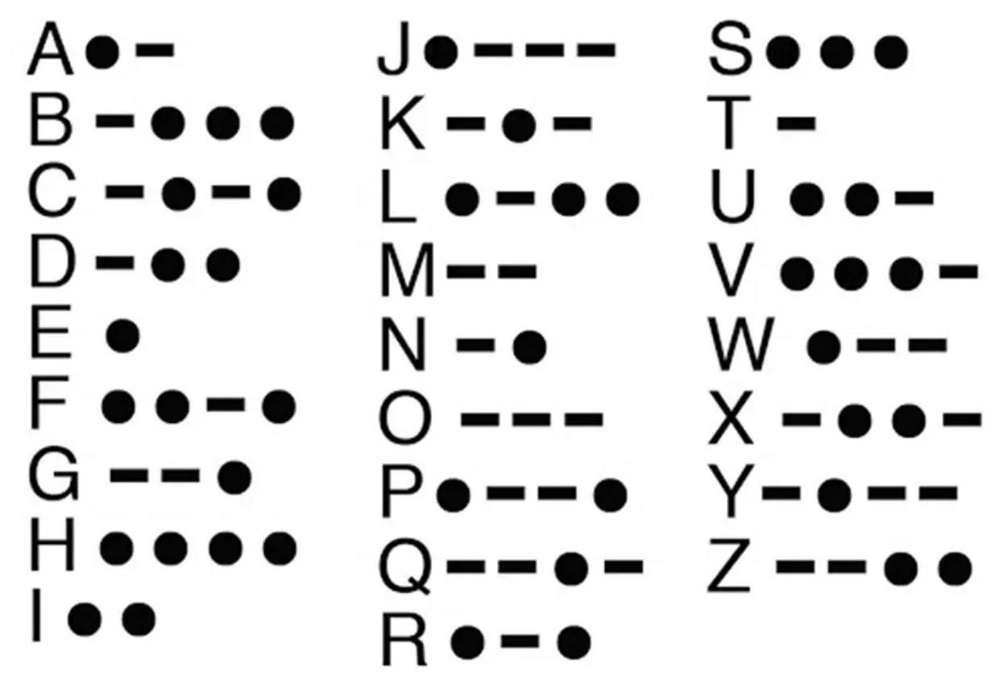

# c003 - 5 MINUTES LEFT TO LIVE

This chapter mentions Morse code and frequency analysis but does not present a complete puzzle to transcribe. The playable level is therefore a game-original adaptation of the techniques introduced in the manga.

## Assets

- Morse-code chapter reference: `assets/chapters/c003/morse-code.png`
- Frequency-analysis reference image can be added later if you save the corresponding panel under `assets/chapters/c003/`.

## Chapter Reference - Morse Code

## Puzzle 1 - Urgent Signal

### Mechanic

Morse code is a direct encoding system: dots and dashes represent individual characters, separated by spaces.

### Game-Original Clue

- Transmission: `.... ..- .-. .-. -.--`
- Answer: `HURRY`

### Code Mapping

- Reusable helpers: `encode_morse()` and `decode_morse()` in `src/ciphers/morse.py`
- Both functions accept arbitrary user-supplied messages for later decoder-machine use.

## Puzzle 2 - Frequency Evidence

### Mechanic

Frequency analysis counts symbols in an encrypted message. It provides evidence for likely substitutions, not a guaranteed decode: in English, a very common cipher symbol may stand for `E`, but word patterns are needed to confirm that hypothesis.

### Game-Original Clue

The level encrypts a longer English message with a monoalphabetic rotation. The player can attempt to count symbols manually, or reveal a ranked bar chart as a hint:

- Most frequent ciphertext symbol: `H`
- Working hypothesis for the next puzzle: `H -> E`

### Code Mapping

- Reusable helpers: `letter_frequency()`, `ranked_letters()`, `frequency_profile()`, and `most_frequent_symbol()` in `src/ciphers/frequency.py`
- These functions return measurements for any input text; they do not hard-code an answer or automatically claim the plaintext.

## Puzzle 3 - Guided Substitution

### Mechanic

The player combines frequency evidence with repeated word shapes. The previous result supplies `H -> E`, and the repeating three-character word `WKH` can be tested as `THE`.

### Game-Original Clue

- Hint-revealed starting lead: `H -> E`
- Hint-supported pattern: `WKH -> THE`
- Recovered report code: `EAST GATE`

### Code Mapping

- Reusable helpers: `apply_substitution()`, `decode_substitution()`, and `rotation_mapping()` in `src/ciphers/substitution.py`
- The chapter uses a generated rotation mapping as approachable tutorial content, while the API accepts arbitrary substitution mappings.

## Game Adaptation Notes

- Puzzle 1 gives the chapter a direct, satisfying decode before introducing analysis.
- Puzzle 2 deliberately asks for an observation; its bar chart is optional hint content because frequency alone does not uniquely solve a message.
- Puzzle 3 hides its initial substitution lead until the player requests a hint, then converts that evidence into a solving step.
- Later decoder-machine work can reuse these deterministic transforms to generate candidate outputs and pass them to a language-scoring layer for ranking.
